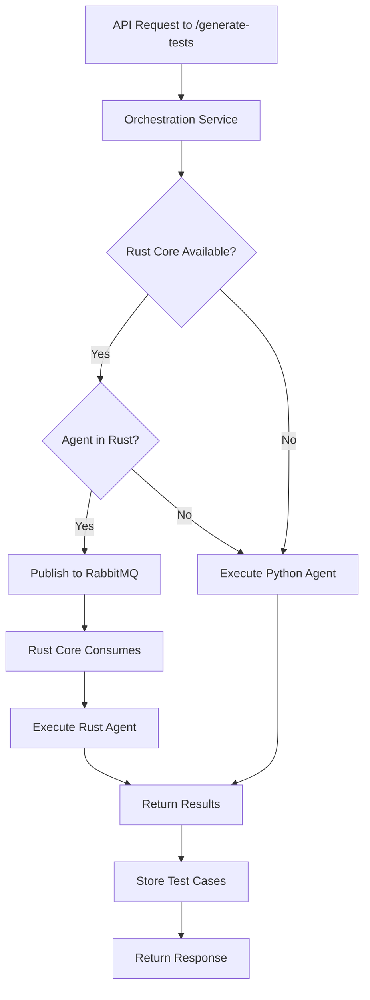

# Sentinel Hybrid Agent Architecture

## Overview

The Sentinel platform implements a **hybrid agent architecture** combining Python and Rust implementations for optimal performance and flexibility. All 7 testing agents now have both Python and Rust implementations, providing automatic failover and performance optimization.

## Architecture Components

### 1. Python Agents (Fallback/Reference Implementation)
- **Location**: `sentinel_backend/orchestration_service/agents/`
- **Purpose**: Reference implementation, LLM integration, fallback when Rust unavailable
- **Execution**: Direct in-process execution

### 2. Rust Agents (High-Performance Implementation)
- **Location**: `sentinel_backend/sentinel_rust_core/src/agents/`
- **Purpose**: High-performance execution, memory safety, concurrent processing
- **Execution**: Via RabbitMQ message queue

### 3. Message Broker (RabbitMQ)
- **Purpose**: Asynchronous communication between Python orchestrator and Rust executor
- **Queue**: `sentinel_task_queue`
- **Pattern**: Work queue with durable messages

## Available Agents

All agents have both Python and Rust implementations:

| Agent Name | Python File | Rust File | Purpose |
|------------|-------------|-----------|---------|
| Functional-Positive-Agent | functional_positive_agent.py | functional_positive.rs | Valid "happy path" test cases |
| Functional-Negative-Agent | functional_negative_agent.py | functional_negative.rs | Invalid data and boundary tests |
| Functional-Stateful-Agent | functional_stateful_agent.py | functional_stateful.rs | Multi-step workflow testing |
| Security-Auth-Agent | security_auth_agent.py | security_auth.rs | Authentication/authorization tests |
| Security-Injection-Agent | security_injection_agent.py | security_injection.rs | Injection vulnerability tests |
| Performance-Planner-Agent | performance_planner_agent.py | performance_planner.rs | Load testing script generation |
| Data-Mocking-Agent | data_mocking_agent.py | data_mocking.rs | Realistic test data generation |

## Execution Flow



## Decision Logic

The orchestration service follows this logic for each agent:

1. **Check Rust Availability**: Is the Rust core service running on port 8088?
2. **Check Agent Implementation**: Is this agent available in Rust?
3. **Execute Appropriately**:
   - If both conditions are true → Use Rust agent via RabbitMQ
   - Otherwise → Use Python agent directly

### Configuration

```python
# In orchestration_service/main.py
USE_RUST_AGENTS = True  # Enable/disable Rust agents globally

RUST_AVAILABLE_AGENTS = {
    "Functional-Positive-Agent",
    "Functional-Negative-Agent", 
    "Functional-Stateful-Agent",
    "Security-Auth-Agent",
    "Security-Injection-Agent",
    "Performance-Planner-Agent",
    "data-mocking",  # Maps from Data-Mocking-Agent
}
```

## Performance Benefits

### Rust Agents Provide:
- **Memory Safety**: No garbage collection pauses
- **Concurrency**: Safe parallel execution without GIL
- **Speed**: 10-50x faster for compute-intensive operations
- **Resource Efficiency**: Lower memory footprint

### Python Agents Provide:
- **LLM Integration**: Easy integration with AI providers
- **Rapid Development**: Quick prototyping and updates
- **Rich Ecosystem**: Access to extensive Python libraries
- **Fallback Safety**: Always available even if Rust fails

## Deployment Modes

### 1. Full Hybrid (Recommended)
- Both Python and Rust services running
- Automatic selection based on availability
- Best performance with fallback safety

```bash
# Start Python orchestration
cd sentinel_backend/orchestration_service
poetry run uvicorn main:app --reload --port 8002

# Start Rust core
cd sentinel_backend/sentinel_rust_core
cargo run --release
```

### 2. Python-Only Mode
- Only Python services running
- All agents execute in Python
- Simpler deployment, lower performance

```bash
# Just start Python services
docker-compose up api_gateway spec_service orchestration_service
```

### 3. Development Mode
- Mix and match for testing
- Easy debugging of individual components

## Adding New Agents

### 1. Create Python Implementation
```python
# orchestration_service/agents/new_agent.py
from .base_agent import BaseAgent, AgentTask, AgentResult

class NewAgent(BaseAgent):
    def __init__(self):
        super().__init__("New-Agent")
    
    async def execute(self, task: AgentTask, api_spec: Dict) -> AgentResult:
        # Implementation
        pass
```

### 2. Create Rust Implementation
```rust
// sentinel_rust_core/src/agents/new_agent.rs
use crate::agents::{Agent, AgentTask, AgentResult};

pub struct NewAgent {
    base: BaseAgent,
}

#[async_trait]
impl Agent for NewAgent {
    fn agent_type(&self) -> &str {
        "New-Agent"
    }
    
    async fn execute(&self, task: AgentTask, api_spec: Value) -> AgentResult {
        // Implementation
    }
}
```

### 3. Register in Both Systems
```python
# Python: orchestration_service/main.py
python_agents["New-Agent"] = NewAgent()
RUST_AVAILABLE_AGENTS.add("New-Agent")
```

```rust
// Rust: sentinel_rust_core/src/agents/mod.rs
agents.insert(
    "New-Agent".to_string(),
    Box::new(new_agent::NewAgent::new()),
);
```

## Testing

### Test Rust Agents
```bash
cd sentinel_rust_core
cargo test
```

### Test Python Agents
```bash
cd sentinel_backend
pytest orchestration_service/tests/
```

### Integration Testing
```bash
# Start all services
docker-compose up

# Run integration tests
pytest tests/e2e/test_hybrid_agents.py
```

## Monitoring

### Check Agent Availability
```bash
# Rust agents
curl http://localhost:8088/health | jq .available_agents

# Python orchestration status
curl http://localhost:8002/health
```

### RabbitMQ Management
```bash
# Access RabbitMQ management UI
open http://localhost:15672
# Default credentials: guest/guest
```

## Troubleshooting

### Issue: Rust agents not being used
1. Check Rust core is running: `curl http://localhost:8088/health`
2. Check RabbitMQ is accessible: `docker ps | grep rabbitmq`
3. Check logs: `docker-compose logs orchestration_service`

### Issue: Agent name mismatch
- Python uses "Data-Mocking-Agent"
- Rust uses "data-mocking"
- Mapping is handled automatically in orchestration service

### Issue: Performance not improved
1. Verify USE_RUST_AGENTS = True
2. Check agent is in RUST_AVAILABLE_AGENTS
3. Monitor RabbitMQ queue for message processing

## Future Improvements

1. **Dynamic Agent Discovery**: Auto-detect available agents
2. **Performance Metrics**: Track execution time per agent/language
3. **Load Balancing**: Distribute across multiple Rust instances
4. **Caching**: Share results between Python and Rust
5. **WebAssembly**: Browser-based agent execution