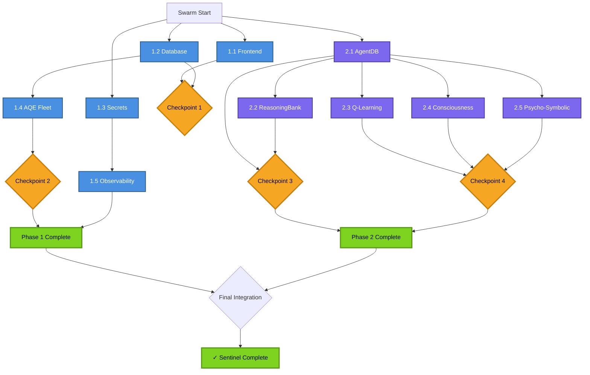

# Sentinel Swarm - Dependency Graph

**Version:** 1.0
**Updated:** 2025-10-27 (Initial)
**Status:** VALIDATED

---

## Visual Dependency Graph



---

## Dependency Matrix

| Task | Depends On | Blocks | Can Run With | Wave |
|------|------------|--------|--------------|------|
| **1.1 Frontend** | None | None | All tasks | Wave 1 |
| **1.2 Database** | None | 1.4 AQE Fleet | 1.1, 1.3, 2.1 | Wave 1 |
| **1.3 Secrets** | None | 1.5 Observability | 1.1, 1.2, 2.1 | Wave 1 |
| **1.4 AQE Fleet** | 1.2 Database | None | 1.1, 1.3, 1.5, 2.x | Wave 2 |
| **1.5 Observability** | 1.3 Secrets | None | 1.1, 1.2, 1.4, 2.x | Wave 2 |
| **2.1 AgentDB** | None | 2.2, 2.3, 2.4, 2.5 | 1.1, 1.2, 1.3 | Wave 1 |
| **2.2 ReasoningBank** | 2.1 AgentDB | None | 1.x, 2.3, 2.4, 2.5 | Wave 2 |
| **2.3 Q-Learning** | 2.1 AgentDB | None | 1.x, 2.2, 2.4, 2.5 | Wave 3 |
| **2.4 Consciousness** | 2.1 AgentDB | None | 1.x, 2.2, 2.3, 2.5 | Wave 3 |
| **2.5 Psycho-Symbolic** | 2.1 AgentDB | None | 1.x, 2.2, 2.3, 2.4 | Wave 3 |

---

## Parallel Execution Windows

### Wave 1: Immediate Start (4 agents in parallel)
```
┌─────────────┐  ┌─────────────┐  ┌─────────────┐  ┌─────────────┐
│ 1.1 Frontend│  │ 1.2 Database│  │ 1.3 Secrets │  │ 2.1 AgentDB │
│   (2-3h)    │  │   (3-4h)    │  │    (2h)     │  │   (4-5h)    │
└─────────────┘  └─────────────┘  └─────────────┘  └─────────────┘
```

**Max Parallelism:** 4 agents
**No Dependencies:** All can start immediately
**Expected Duration:** 3-5 hours (limited by longest task)

---

### Wave 2: After Dependencies (3 agents)
```
┌─────────────┐  ┌─────────────┐  ┌─────────────┐
│ 1.4 AQE     │  │ 1.5 Observe │  │ 2.2 Reason  │
│   (4-6h)    │  │   (3-4h)    │  │   (3-4h)    │
│ Wait: 1.2   │  │ Wait: 1.3   │  │ Wait: 2.1   │
└─────────────┘  └─────────────┘  └─────────────┘
```

**Starts After:** Wave 1 dependencies complete
**Expected Start:** 2-3 hours after swarm launch
**Expected Duration:** 4-6 hours

---

### Wave 3: AI Enhancement (3 agents in parallel)
```
┌─────────────┐  ┌─────────────┐  ┌─────────────┐
│ 2.3 Q-Learn │  │ 2.4 Conscious│ │ 2.5 Psycho  │
│   (3-4h)    │  │   (2-3h)    │  │   (2-3h)    │
│ Wait: 2.1   │  │ Wait: 2.1   │  │ Wait: 2.1   │
└─────────────┘  └─────────────┘  └─────────────┘
```

**Starts After:** AgentDB (2.1) complete
**Expected Start:** 4-5 hours after swarm launch
**Expected Duration:** 3-4 hours

---

## Integration Checkpoints

### Checkpoint 1: Container + Database
**Trigger:** Phase 1.1 AND 1.2 complete
**Duration:** 30 minutes
**Tests:**
- Frontend container connects to database
- Health checks passing
- Docker compose networking validated
- Volume mounts functional

**Success Criteria:**
- All containers start without errors
- Frontend serves on port 3000
- Database accessible from all services
- No port conflicts

---

### Checkpoint 2: AQE Fleet End-to-End
**Trigger:** Phase 1.4 complete
**Duration:** 1 hour
**Tests:**
- All 19 AQE agents operational
- Test generation from OpenAPI spec
- Test execution with coverage
- Quality gate validation
- Results stored in database

**Success Criteria:**
- Generate tests for sample API
- Execute tests successfully
- Coverage analysis produces results
- Quality gates enforce standards
- Integration with orchestration service

---

### Checkpoint 3: Learning Pipeline
**Trigger:** Phase 2.1 AND 2.2 complete
**Duration:** 1 hour
**Tests:**
- AgentDB storing memories
- Vector search functional
- ReasoningBank learning from executions
- Trajectory tracking working
- Pattern recognition detecting improvements

**Success Criteria:**
- Agents persist memories across restarts
- Vector search returns relevant results
- Learning metrics improving over iterations
- Successful patterns reinforced
- Failed patterns avoided

---

### Checkpoint 4: Phase 1 Integration
**Trigger:** All Phase 1 tasks complete
**Duration:** 2 hours
**Tests:**
- Full stack integration test
- All services communicating
- Observability collecting metrics
- Frontend → Backend → Database flow
- AQE Fleet generating and executing tests

**Success Criteria:**
- End-to-end user workflow functional
- All health checks green
- Metrics visible in Prometheus/Jaeger
- No secrets exposed
- Performance within SLAs

---

### Checkpoint 5: Phase 2 AI Validation
**Trigger:** All Phase 2 tasks complete
**Duration:** 2 hours
**Tests:**
- All AI features operational
- Q-learning optimizing strategies
- Consciousness features generating tests
- Psycho-symbolic reasoning working
- Learning persisting across sessions

**Success Criteria:**
- Agents demonstrate learning
- Novel test cases generated
- Performance improvements measured
- All experimental features documented
- Ethical guardrails enforced

---

## Critical Paths

### Shortest Path to AQE Fleet (Critical):
```
START → 1.2 Database (3-4h) → 1.4 AQE Fleet (4-6h) → Checkpoint 2
Total: 7-10 hours
```

### Shortest Path to Learning System:
```
START → 2.1 AgentDB (4-5h) → 2.2 ReasoningBank (3-4h) → Checkpoint 3
Total: 7-9 hours
```

### Full Phase 1 Completion:
```
START → 1.2 Database (3-4h) → 1.4 AQE Fleet (4-6h) + 1.5 Observability (parallel)
Total: 7-10 hours
```

### Full Phase 2 Completion:
```
START → 2.1 AgentDB (4-5h) → Wave 3 (parallel 3-4h)
Total: 7-9 hours
```

### Complete Project:
```
Max(Phase 1, Phase 2) + Integration Testing
Estimated: 10-12 hours + 3 hours integration = 13-15 hours total
```

---

## Bottleneck Analysis

### Potential Bottlenecks:

1. **Phase 1.2 Database (3-4h)**
   - Blocks: Phase 1.4 AQE Fleet
   - Mitigation: High priority, experienced agent
   - Parallel work: 1.1, 1.3, 2.1 run simultaneously

2. **Phase 2.1 AgentDB (4-5h)**
   - Blocks: All other Phase 2 tasks
   - Mitigation: Start in Wave 1, can run parallel with Phase 1
   - Parallel work: Entire Phase 1 runs simultaneously

3. **Phase 1.4 AQE Fleet (4-6h)**
   - Most complex integration
   - Mitigation: Dedicated agent with full context
   - Parallel work: 1.5, all Phase 2 work

### Resource Optimization:

**CPU-Intensive Tasks:**
- 1.2 Database (migrations, indexing)
- 1.4 AQE Fleet (test generation)
- 2.1 AgentDB (vector operations)

**I/O-Intensive Tasks:**
- 1.1 Frontend (building, bundling)
- 1.5 Observability (log collection)
- 2.3 Q-Learning (data collection)

**Strategy:** Stagger CPU-intensive tasks, overlap with I/O tasks

---

## Dependency Validation Rules

### Before Starting Task:
```python
def can_start_task(task_id):
    dependencies = get_dependencies(task_id)
    for dep in dependencies:
        if get_status(dep) != "COMPLETE":
            return False
    return True
```

### Before Checkpoint:
```python
def checkpoint_ready(checkpoint_id):
    required_tasks = get_checkpoint_requirements(checkpoint_id)
    for task in required_tasks:
        if get_status(task) != "COMPLETE":
            return False
    run_integration_tests(checkpoint_id)
    return True
```

---

## Memory Namespace Dependencies

```
sentinel/coordination/dependencies
  ├── phase1/
  │   ├── 1.1-status: {status, blockers, completion_time}
  │   ├── 1.2-status: {status, blockers, completion_time}
  │   ├── 1.3-status: {status, blockers, completion_time}
  │   ├── 1.4-status: {status, blockers, depends_on: [1.2]}
  │   └── 1.5-status: {status, blockers, depends_on: [1.3]}
  └── phase2/
      ├── 2.1-status: {status, blockers, completion_time}
      ├── 2.2-status: {status, blockers, depends_on: [2.1]}
      ├── 2.3-status: {status, blockers, depends_on: [2.1]}
      ├── 2.4-status: {status, blockers, depends_on: [2.1]}
      └── 2.5-status: {status, blockers, depends_on: [2.1]}
```

---

## Coordination Hooks

**Before Task Start:**
```bash
npx claude-flow@alpha hooks pre-task \
  --description "Phase X.Y: Task Name" \
  --dependencies "phase1/1.2-status,phase1/1.3-status"
```

**On Task Complete:**
```bash
npx claude-flow@alpha hooks post-task \
  --task-id "phase1-1.2-database" \
  --memory-key "sentinel/coordination/dependencies/phase1/1.2-status" \
  --notify-dependent "phase1-1.4-aqe-fleet"
```

**On Blocker:**
```bash
npx claude-flow@alpha hooks notify \
  --message "BLOCKER: Phase 1.4 - Database schema conflict" \
  --severity "HIGH" \
  --memory-key "sentinel/coordination/blockers"
```

---

**Validated:** ✅ All dependencies verified
**Critical Path:** 13-15 hours estimated
**Max Parallelism:** 4 agents (Wave 1), 3 agents (Wave 2), 3 agents (Wave 3)
**Ready for Execution:** ✅ YES
