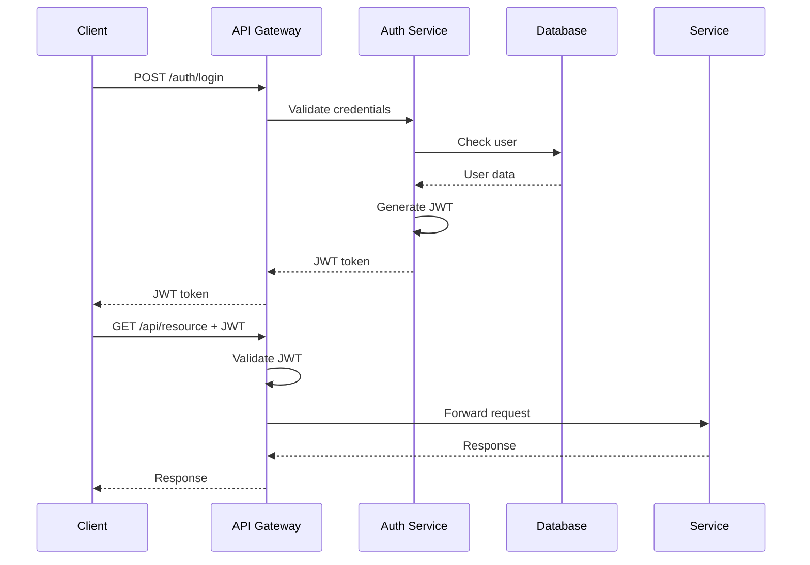

# Architecture Overview

Sentinel employs a modern microservices architecture designed for scalability, maintainability, and extensibility. This document provides a comprehensive overview of the system architecture, design decisions, and architectural patterns.

## System Architecture

### High-Level Architecture

```
┌──────────────────────────────────────────────────────────────┐
│                         Client Layer                          │
│  (Web UI, CLI, CI/CD Tools, API Clients)                     │
└────────────────────────┬─────────────────────────────────────┘
                         │
┌────────────────────────▼─────────────────────────────────────┐
│                    API Gateway (Port 8000)                    │
│  • Authentication & Authorization                             │
│  • Request Routing & Load Balancing                          │
│  • Rate Limiting & Throttling                                │
│  • Request/Response Transformation                           │
│  • BFF (Backend for Frontend) Endpoints                     │
└────────────────────────┬─────────────────────────────────────┘
                         │
        ┌────────────────┼────────────────┬───────────────┐
        │                │                │               │
┌───────▼──────┐ ┌──────▼──────┐ ┌───────▼──────┐ ┌──────▼──────┐
│Auth Service  │ │Spec Service │ │Orchestration │ │Data Service │
│   (8005)     │ │   (8001)    │ │   (8002)     │ │   (8004)    │
└──────────────┘ └─────────────┘ └──────┬───────┘ └─────────────┘
                                         │
                                  ┌──────▼──────┐
                                  │  Execution  │
                                  │Service(8003)│
                                  └──────┬──────┘
                                         │
┌────────────────────────────────────────┼─────────────────────┐
│                    Message Broker (RabbitMQ)                  │
│                     • Task Queues                             │
│                     • Result Queues                           │
│                     • Event Streaming                         │
└────────────────────────────────┬─────────────────────────────┘
                                  │
                          ┌───────▼────────┐
                          │ Sentinel Rust  │
                          │  Core (8088)   │
                          │ • Agent Engine │
                          │ • WASM Runtime│
                          └────────────────┘
```

### Data Layer Architecture

```
┌─────────────────────────────────────────────────────────────┐
│                    PostgreSQL Database                       │
│  • Main Database (Port 5432)                                │
│  • pgvector Extension for ML embeddings                     │
│  • Time-series partitioning for metrics                     │
└─────────────────────────────────────────────────────────────┘
                              │
                    ┌─────────┼─────────┐
                    │         │         │
              ┌─────▼───┐ ┌──▼───┐ ┌───▼────┐
              │ Redis   │ │ S3   │ │Elastic │
              │ Cache   │ │Object│ │Search  │
              └─────────┘ └──────┘ └────────┘
```

## Architectural Patterns

### 1. Microservices Pattern

Each service is:
- **Independently deployable**: Can be updated without affecting others
- **Loosely coupled**: Communicates via well-defined APIs
- **Single responsibility**: Focused on one business capability
- **Autonomous**: Has its own data store (logical separation)

### 2. API Gateway Pattern

The API Gateway provides:
- **Single entry point**: Simplifies client interaction
- **Cross-cutting concerns**: Authentication, logging, rate limiting
- **Protocol translation**: HTTP/REST to internal protocols
- **Request aggregation**: BFF endpoints for optimized data fetching

### 3. Event-Driven Architecture

```python
# Event flow example
class TestExecutionEvent:
    event_type = "test.execution.started"
    payload = {
        "test_run_id": "uuid",
        "spec_id": 1,
        "test_types": ["functional", "security"],
        "timestamp": "2025-01-08T10:00:00Z"
    }

# Publisher (Orchestration Service)
async def publish_event(event):
    await message_broker.publish(
        exchange="sentinel.events",
        routing_key=event.event_type,
        body=event.payload
    )

# Consumer (Data Service)
async def consume_event(event):
    if event.type == "test.execution.started":
        await create_test_run_record(event.payload)
```

### 4. CQRS (Command Query Responsibility Segregation)

```python
# Command Model (Write)
class CreateTestRunCommand:
    def execute(self, spec_id, test_types):
        # Validate and create test run
        # Publish events
        # Return command result
        pass

# Query Model (Read)
class TestRunQuery:
    def get_test_run_details(self, test_run_id):
        # Optimized read from denormalized view
        # Include aggregated metrics
        # Return rich response
        pass
```

### 5. Circuit Breaker Pattern

```python
from circuit_breaker import CircuitBreaker

class ServiceClient:
    def __init__(self):
        self.circuit_breaker = CircuitBreaker(
            failure_threshold=5,
            recovery_timeout=60,
            expected_exception=RequestException
        )
    
    @circuit_breaker
    async def call_service(self, endpoint, data):
        # Make service call
        # Circuit opens after 5 failures
        # Attempts recovery after 60 seconds
        pass
```

## Service Architecture

### Service Structure

Each microservice follows this structure:

```
service_name/
├── main.py              # FastAPI application
├── models.py            # Database models (SQLAlchemy)
├── schemas.py           # Pydantic schemas
├── services/            # Business logic
│   ├── __init__.py
│   └── core_service.py
├── api/                 # API endpoints
│   ├── __init__.py
│   └── endpoints.py
├── dependencies.py      # Dependency injection
├── config.py           # Service configuration
└── Dockerfile          # Container definition
```

### Service Communication

#### Synchronous Communication (REST)

```python
# Service-to-service REST call
async def call_spec_service(spec_id: int):
    async with httpx.AsyncClient() as client:
        response = await client.get(
            f"{SPEC_SERVICE_URL}/specifications/{spec_id}",
            headers={"X-Correlation-ID": correlation_id}
        )
        return response.json()
```

#### Asynchronous Communication (Message Queue)

```python
# Task publication
async def publish_test_task(task_data):
    await broker.publish(
        queue="test_execution_queue",
        message={
            "task_id": str(uuid4()),
            "spec_id": task_data.spec_id,
            "test_type": task_data.test_type,
            "timestamp": datetime.utcnow().isoformat()
        },
        persistent=True
    )

# Task consumption
async def consume_test_task():
    async for message in broker.consume("test_execution_queue"):
        try:
            await process_test_task(message.body)
            await message.ack()
        except Exception as e:
            await message.nack(requeue=True)
```

## Data Architecture

### Database Schema Design

```sql
-- Logical data model
┌─────────────┐     ┌──────────────┐     ┌──────────────┐
│Specification│────<│  TestSuite   │────<│   TestCase   │
└─────────────┘     └──────────────┘     └──────────────┘
       │                    │                     │
       │                    │                     │
       ▼                    ▼                     ▼
┌─────────────┐     ┌──────────────┐     ┌──────────────┐
│   TestRun   │────<│TestExecution │────<│ TestResult   │
└─────────────┘     └──────────────┘     └──────────────┘
```

### Data Partitioning Strategy

```sql
-- Time-based partitioning for test results
CREATE TABLE test_results (
    id BIGSERIAL,
    test_run_id UUID,
    test_case_id INTEGER,
    status VARCHAR(20),
    created_at TIMESTAMP,
    -- ... other columns
) PARTITION BY RANGE (created_at);

-- Monthly partitions
CREATE TABLE test_results_2025_01 
    PARTITION OF test_results
    FOR VALUES FROM ('2025-01-01') TO ('2025-02-01');
```

### Caching Strategy

```python
# Multi-level caching
class CacheManager:
    def __init__(self):
        self.l1_cache = {}  # In-memory
        self.l2_cache = Redis()  # Distributed
        
    async def get(self, key):
        # Check L1 cache
        if key in self.l1_cache:
            return self.l1_cache[key]
        
        # Check L2 cache
        value = await self.l2_cache.get(key)
        if value:
            self.l1_cache[key] = value
            return value
        
        # Fetch from database
        value = await self.fetch_from_db(key)
        await self.set(key, value)
        return value
```

## Security Architecture

### Defense in Depth

```
Layer 1: Network Security
├── TLS/SSL encryption
├── VPC/Network segmentation
└── Web Application Firewall (WAF)

Layer 2: Application Security
├── JWT authentication
├── OAuth 2.0 / OIDC
├── Role-Based Access Control (RBAC)
└── Input validation & sanitization

Layer 3: Data Security
├── Encryption at rest (AES-256)
├── Encryption in transit (TLS 1.3)
├── Data masking & anonymization
└── Audit logging

Layer 4: Infrastructure Security
├── Container security scanning
├── Secrets management (Vault)
├── Infrastructure as Code (IaC)
└── Security monitoring & alerting
```

### Authentication Flow



## Scalability Architecture

### Horizontal Scaling

```yaml
# Kubernetes deployment example
apiVersion: apps/v1
kind: Deployment
metadata:
  name: orchestration-service
spec:
  replicas: 3  # Horizontal scaling
  selector:
    matchLabels:
      app: orchestration-service
  template:
    spec:
      containers:
      - name: orchestration-service
        image: sentinel/orchestration:latest
        resources:
          requests:
            memory: "256Mi"
            cpu: "250m"
          limits:
            memory: "512Mi"
            cpu: "500m"
```

### Load Balancing

```nginx
# NGINX load balancer configuration
upstream orchestration_service {
    least_conn;  # Load balancing algorithm
    server orchestration-1:8002 weight=1;
    server orchestration-2:8002 weight=1;
    server orchestration-3:8002 weight=1;
    
    # Health checks
    health_check interval=5s fails=3 passes=2;
}
```

## Observability Architecture

### Three Pillars of Observability

#### 1. Logging
```python
# Structured logging
logger.info("Test execution started",
    extra={
        "correlation_id": request.correlation_id,
        "test_run_id": test_run.id,
        "user_id": user.id,
        "test_types": test_types,
        "timestamp": datetime.utcnow().isoformat()
    }
)
```

#### 2. Metrics
```python
# Prometheus metrics
from prometheus_client import Counter, Histogram

test_execution_counter = Counter(
    'test_executions_total',
    'Total number of test executions',
    ['test_type', 'status']
)

test_execution_duration = Histogram(
    'test_execution_duration_seconds',
    'Test execution duration',
    ['test_type']
)
```

#### 3. Tracing
```python
# Distributed tracing with OpenTelemetry
from opentelemetry import trace

tracer = trace.get_tracer(__name__)

with tracer.start_as_current_span("execute_test") as span:
    span.set_attribute("test.type", test_type)
    span.set_attribute("test.run_id", test_run_id)
    # Execute test logic
```

## Deployment Architecture

### Container Orchestration

```yaml
# Docker Compose for development
version: '3.8'
services:
  api-gateway:
    build: ./api_gateway
    ports:
      - "8000:8000"
    depends_on:
      - auth-service
      - spec-service
    environment:
      - SERVICE_DISCOVERY_URL=http://service-discovery:8500
    networks:
      - sentinel-network

  auth-service:
    build: ./auth_service
    ports:
      - "8005:8005"
    environment:
      - DB_URL=postgresql://postgres:password@db:5432/sentinel
    networks:
      - sentinel-network
```

### CI/CD Pipeline

```yaml
# GitLab CI/CD pipeline
stages:
  - build
  - test
  - deploy

build:
  stage: build
  script:
    - docker build -t sentinel/service:$CI_COMMIT_SHA .
    - docker push sentinel/service:$CI_COMMIT_SHA

test:
  stage: test
  script:
    - pytest tests/
    - cargo test

deploy:
  stage: deploy
  script:
    - kubectl set image deployment/service service=sentinel/service:$CI_COMMIT_SHA
    - kubectl rollout status deployment/service
```

## Performance Considerations

### Database Optimization

```sql
-- Strategic indexes
CREATE INDEX idx_test_runs_spec_id ON test_runs(spec_id);
CREATE INDEX idx_test_results_status ON test_results(status) WHERE status = 'failed';
CREATE INDEX idx_test_results_created ON test_results(created_at DESC);

-- Materialized views for analytics
CREATE MATERIALIZED VIEW test_run_summary AS
SELECT 
    tr.id,
    tr.spec_id,
    COUNT(tres.id) as total_tests,
    SUM(CASE WHEN tres.status = 'passed' THEN 1 ELSE 0 END) as passed,
    AVG(tres.execution_time) as avg_execution_time
FROM test_runs tr
JOIN test_results tres ON tr.id = tres.test_run_id
GROUP BY tr.id, tr.spec_id;
```

### Caching Strategies

```python
# Cache warming
async def warm_cache():
    # Pre-load frequently accessed data
    specs = await get_active_specifications()
    for spec in specs:
        await cache.set(f"spec:{spec.id}", spec, ttl=3600)

# Cache invalidation
async def invalidate_cache(pattern: str):
    keys = await cache.scan(pattern)
    for key in keys:
        await cache.delete(key)
```

## Disaster Recovery

### Backup Strategy

```bash
# Automated database backups
#!/bin/bash
# Daily backup script
pg_dump -h $DB_HOST -U $DB_USER -d sentinel > backup_$(date +%Y%m%d).sql
aws s3 cp backup_$(date +%Y%m%d).sql s3://sentinel-backups/
```

### High Availability

```yaml
# Multi-region deployment
regions:
  primary:
    location: us-east-1
    services: all
    database: primary
  
  secondary:
    location: eu-west-1
    services: all
    database: read-replica
  
  dr:
    location: ap-southeast-1
    services: minimal
    database: standby
```

## Next Steps

- Review [Service Components](./services.md) for detailed service documentation
- Explore [Agent Implementation](./agents.md) for AI agent architecture
- Learn about [Database Design](./database.md) for data modeling

---

← [Back to Technical Guide](./index.md) | [Next: Service Components](./services.md) →