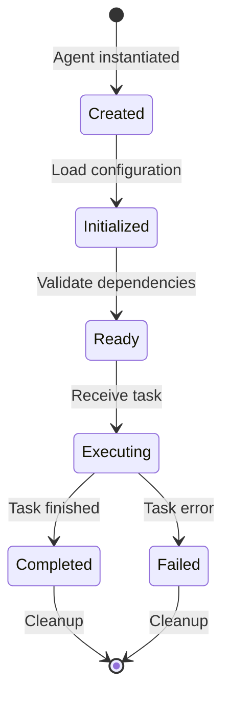

# Technical Guide - Sentinel API Testing Platform

This comprehensive technical guide provides in-depth documentation for developers, system administrators, and contributors working with the Sentinel platform.

## 📚 Table of Contents

1. [Architecture Overview](./architecture.md) - System design and components
2. [Service Components](./services.md) - Detailed service documentation
3. [Agent Implementation](./agents.md) - AI agent architecture and algorithms
4. [Database Design](./database.md) - Schema, models, and migrations
5. [Configuration Management](./configuration.md) - Settings and environment management
6. [Security Architecture](./security.md) - Authentication, authorization, and security measures
7. [Observability Stack](./observability.md) - Logging, metrics, and tracing
8. [Message Broker Integration](./message-broker.md) - Asynchronous communication
9. [Rust Core Integration](./rust-core.md) - High-performance agent execution
10. [Development Guide](./development.md) - Contributing and extending Sentinel

## 🏗️ System Architecture

### Microservices Architecture

Sentinel follows a microservices architecture pattern with the following key principles:

- **Service Independence**: Each service has its own database and deployment lifecycle
- **API-First Design**: All communication through well-defined REST APIs
- **Asynchronous Processing**: Message broker for long-running tasks
- **Horizontal Scalability**: Services can be scaled independently
- **Fault Tolerance**: Circuit breakers and retry mechanisms

### Technology Stack

| Layer | Technologies |
|-------|-------------|
| **Frontend** | React, Redux Toolkit, React Query, Tailwind CSS |
| **Backend Services** | Python 3.10+, FastAPI, Pydantic |
| **Agent Core** | Rust, ruv-swarm, WebAssembly |
| **Database** | PostgreSQL 14+ with pgvector |
| **Message Broker** | RabbitMQ |
| **Observability** | Prometheus, Jaeger, structlog |
| **Container** | Docker, Docker Compose |
| **CI/CD** | GitHub Actions, GitLab CI, Jenkins |

## 🔧 Core Components

### Service Mesh

```
┌─────────────────────────────────────────────────────────┐
│                     API Gateway (8000)                   │
│                  (Authentication, Routing)               │
└─────────────┬───────────────────────────────────────────┘
              │
    ┌─────────┴─────────┬──────────┬──────────┬──────────┐
    │                   │          │          │          │
┌───▼────┐      ┌──────▼────┐ ┌───▼────┐ ┌──▼───┐ ┌────▼────┐
│  Auth  │      │   Spec    │ │  Orch  │ │ Exec │ │  Data   │
│Service │      │  Service  │ │Service │ │ Svc  │ │Service  │
│ (8005) │      │  (8001)   │ │ (8002) │ │(8003)│ │ (8004)  │
└────────┘      └───────────┘ └───┬────┘ └──────┘ └─────────┘
                                   │
                            ┌──────▼──────┐
                            │ Rust Core   │
                            │   (8088)    │
                            └─────────────┘
```

### Data Flow

1. **API Specification Upload**
   ```
   Client → API Gateway → Spec Service → Database
   ```

2. **Test Execution**
   ```
   Client → API Gateway → Orchestration → Message Broker → Rust Core → Execution Service → Database
   ```

3. **Results Retrieval**
   ```
   Client → API Gateway → Data Service → Database → Analytics Processing → Client
   ```

## 🔐 Security Layers

### Defense in Depth

1. **Network Security**
   - TLS/SSL encryption
   - Network segmentation
   - Firewall rules

2. **Application Security**
   - JWT authentication
   - Role-based access control
   - Input validation
   - SQL injection prevention

3. **Data Security**
   - Encryption at rest
   - Encryption in transit
   - Sensitive data masking
   - Audit logging

## 🚀 Performance Optimization

### Caching Strategy

```python
# Multi-level caching
L1: In-memory cache (Redis)     # Hot data, <100ms
L2: Database cache (PostgreSQL) # Warm data, <500ms
L3: Object storage (S3)         # Cold data, <2s
```

### Scaling Patterns

1. **Horizontal Scaling**
   - Stateless services
   - Load balancing
   - Auto-scaling policies

2. **Vertical Scaling**
   - Resource optimization
   - Database tuning
   - Query optimization

## 📊 Database Architecture

### Schema Design Principles

- **Normalization**: 3NF for transactional data
- **Denormalization**: Read-optimized views for analytics
- **Partitioning**: Time-based partitioning for test results
- **Indexing**: Strategic indexes for query performance

### Key Tables

```sql
-- Core entities
specifications     -- API specifications
test_suites       -- Test suite definitions
test_cases        -- Individual test cases
test_runs         -- Test execution instances
test_results      -- Test execution results

-- Analytics
test_metrics      -- Performance metrics
test_trends       -- Historical trends
anomalies         -- Detected anomalies

-- Security
users             -- User accounts
roles             -- Role definitions
permissions       -- Permission mappings
audit_logs        -- Security audit trail
```

## 🔄 Agent Architecture

### Agent Lifecycle



### Agent Types and Responsibilities

| Agent | Responsibility | Key Algorithms |
|-------|---------------|----------------|
| **Functional-Positive** | Valid test cases | Schema analysis, data generation |
| **Functional-Negative** | Invalid test cases | Boundary value analysis, fuzzing |
| **Functional-Stateful** | Workflow testing | SODG construction, state management |
| **Security-Auth** | Auth vulnerabilities | BOLA detection, privilege escalation |
| **Security-Injection** | Injection attacks | Payload generation, pattern matching |
| **Performance-Planner** | Load test scenarios | Workload modeling, script generation |
| **Data-Mocking** | Test data generation | Faker, schema-aware generation |

## 🔌 Integration Points

### External Systems

1. **CI/CD Platforms**
   - GitHub Actions
   - GitLab CI
   - Jenkins
   - CircleCI

2. **Monitoring Systems**
   - Prometheus
   - Grafana
   - ELK Stack
   - Datadog

3. **Notification Services**
   - Slack
   - Email (SMTP)
   - Webhooks
   - PagerDuty

## 🛠️ Development Workflow

### Local Development Setup

```bash
# Clone repository
git clone https://github.com/proffesor-for-testing/sentinel-api-testing.git

# Set up Python environment
cd sentinel_backend
poetry install

# Set up Rust environment
cd sentinel_rust_core
cargo build

# Start services
docker-compose up -d

# Run tests
pytest
cargo test
```

### Code Organization

```
sentinel_backend/
├── api_gateway/        # API Gateway service
├── auth_service/       # Authentication service
├── spec_service/       # Specification management
├── orchestration_service/
│   └── agents/        # Python agent implementations
├── execution_service/  # Test execution
├── data_service/      # Data and analytics
├── config/            # Configuration management
├── tests/             # Test suites
└── alembic/           # Database migrations

sentinel_rust_core/
├── src/
│   ├── agents/        # Rust agent implementations
│   ├── types.rs       # Type definitions
│   └── main.rs        # Service entry point
└── Cargo.toml         # Rust dependencies
```

## 📈 Performance Benchmarks

### Service Response Times

| Operation | P50 | P95 | P99 |
|-----------|-----|-----|-----|
| Spec Upload | 150ms | 500ms | 1s |
| Test Execution | 2s | 10s | 30s |
| Results Query | 50ms | 200ms | 500ms |
| Analytics | 200ms | 1s | 3s |

### Throughput Capabilities

- **API Gateway**: 10,000 req/s
- **Test Execution**: 100 concurrent tests
- **Data Processing**: 1M results/hour
- **Analytics**: Real-time for <100K records

## 🔍 Debugging and Troubleshooting

### Debug Tools

1. **Logging**
   ```python
   # Structured logging with correlation IDs
   logger.info("Processing request", 
               correlation_id=request.correlation_id,
               user_id=user.id,
               action="test_execution")
   ```

2. **Tracing**
   ```python
   # Distributed tracing with Jaeger
   with tracer.start_span("test_execution") as span:
       span.set_tag("test_type", "functional")
       # ... execution logic
   ```

3. **Metrics**
   ```python
   # Prometheus metrics
   test_execution_duration.observe(duration)
   test_execution_counter.inc()
   ```

## 🚦 Health Checks

### Service Health Endpoints

All services expose health check endpoints:

```bash
# Basic health check
GET /health

# Detailed health check
GET /health/ready

# Liveness probe
GET /health/live
```

### Health Check Response

```json
{
  "status": "healthy",
  "version": "1.0.0",
  "timestamp": "2025-01-08T10:00:00Z",
  "checks": {
    "database": "healthy",
    "message_broker": "healthy",
    "dependencies": "healthy"
  }
}
```

## 📚 Additional Resources

- [API Reference](../api-reference/index.md) - Complete API documentation
- [Deployment Guide](../deployment/index.md) - Production deployment
- [Contributing Guide](../../CONTRIBUTING.md) - How to contribute
- [Architecture Decision Records](./adr/index.md) - Design decisions

## 🤝 Getting Help

For technical questions:
1. Check the [FAQ](../troubleshooting/faq.md)
2. Search [GitHub Issues](https://github.com/proffesor-for-testing/sentinel-api-testing/issues)
3. Join our [Developer Discord](https://discord.gg/sentinel)
4. Contact the core team

---

Ready to dive deeper? Start with the [Architecture Overview](./architecture.md) →